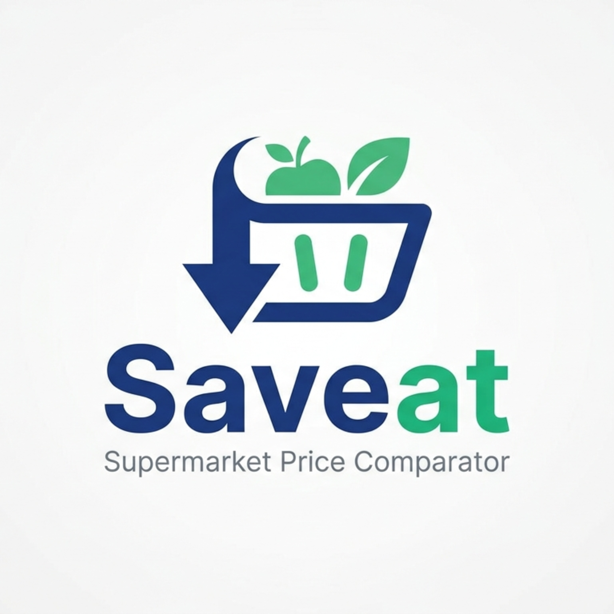

# Saveat

<p align="center">
  
</p>

Self-hosted web app to compare grocery prices across supermarkets.

Grocery prices vary significantly from one store to another, and they change over time. Saveat lets you build a personal price catalog by importing your receipts, then instantly compare the total cost of your usual basket across all your stores. No subscription, no ads, no data sent anywhere. Just your prices, on your server.

Scan a receipt or a PDF invoice with Claude AI, review the detected products, and save the prices in one click. Next time you shop, Saveat tells you where to go. Scan receipts with Claude AI, track price history, and always know which store is cheapest for your usual basket.

## Features

### Price Comparison
- **Multi-store catalog** track prices for the same product across multiple stores
- **Basket comparison** select products and instantly see the cheapest store with total and savings
- **Price history** every price change is recorded, with delta indicators per store
- **Best price display** each product shows its best current price and the store offering it
- **Store color coding** color dots on each product card show at a glance which stores have a price

### Receipt Import
- **Claude AI OCR** analyze a receipt photo or a PDF invoice (e.g. Carrefour home delivery)
- **Smart product matching** fuzzy matching links imported items to existing catalog entries
- **Review before import** edit names, prices, and store assignment before saving
- **Import history** every import is logged with store, item count, and total amount

### Dashboard
- **Home overview** total products, stores, and products missing a price
- **Best store widget** automatically ranks stores by total basket cost, with configurable store selection
- **Recent prices** last prices recorded across all stores
- **Price increase alerts** highlights recent price rises per product and store

### App
- **Dark mode** full dark theme support
- **First-run setup** guided wizard on first launch, no config file needed
- **Rate-limited login** brute-force protection on the auth endpoint

## Screenshots

*Coming soon*

## Quick Start

### 1. Create a `docker-compose.yml`

```yaml
services:
  saveat:
    image: ghcr.io/ninidas/saveat:latest
    container_name: saveat
    restart: unless-stopped
    ports:
      - "8000:8000"
    environment:
      - PUID=1000
      - PGID=1000
    volumes:
      - /path/to/saveat/data:/data
```

Start with `docker compose up -d`.

### 2. First run

Open the app in your browser. You will be guided through a setup wizard to create your account.

## Claude AI (optional)

Receipt scanning requires a Claude API key from [Anthropic](https://console.anthropic.com).

Once you have a key, go to **Settings** in the app and paste it in the Claude API section. The key is stored in the local database and never leaves your server.

Without a key, the app works fully. You can still manage stores, products, and prices manually.

## Configuration

| Variable | Description |
|----------|-------------|
| `PUID` | User ID to run the process as (default: 0 / root) |
| `PGID` | Group ID to run the process as (default: 0 / root) |

The `SECRET_KEY` for JWT signing is auto-generated and persisted in the database on first run.

## Tech Stack

- **Frontend** React, Vite, Tailwind CSS
- **Backend** FastAPI, SQLAlchemy, SQLite
- **Auth** JWT, bcrypt
- **AI** Anthropic Claude API (vision)

## License

AGPL-3.0 - see [LICENSE](LICENSE)
